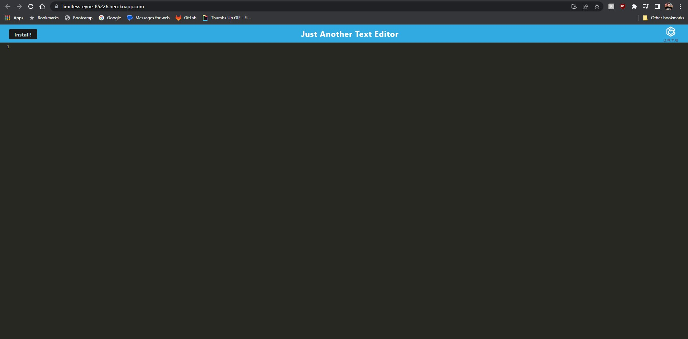

 # PWA-ctice

### Description

A text editor with a service worker

## Table of Contents
1. [Description: ](#description)
2. [Installation Guide: ](#installation-guide)
3. [Images: ](#images)
- [License](#license)
- [Contacts ](#contact-me)

[Back to top](#pwa-ctice)
## Installation Guide

clone the repo, run npm i, npm start, once in you have the option to download for offline use. Or go to [the deployed site](https://limitless-eyrie-85226.herokuapp.com/) and download from there.

[Back to top](#pwa-ctice)
## Images

[Back to top](#pwa-ctice)

## License
  This project is under the MIT License
[Details on the MIT License](https://choosealicense.com/licenses/mit/)

## Contact Me
### Email
[schuylertjed@gmail.com](mailto:schuylertjed@gmail.com)
### Github
[jschuyl](https://github.com/jschuyl)

[Back to top](#pwa-ctice)

